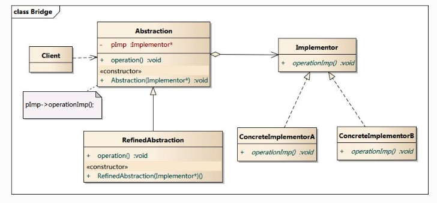
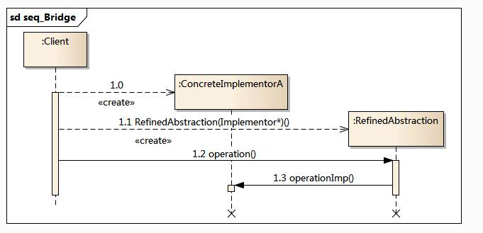

# 设计模式(七):桥接模式

## 模式动机

设想如果要绘制矩形、圆形、椭圆、正方形，我们至少需要4个形状类，但是如果绘制的图形需要具有不同的颜色，如红色、绿色、蓝色等，此时至少有如下两种设计方案：

- 第一种设计方案是为每一种形状都提供一套各种颜色的版本。
- 第二种设计方案是根据实际需要对形状和颜色进行组合

对于有两个变化维度（即两个变化的原因）的系统，采用方案二来进行设计系统中类的个数更少，且系统扩展更为方便。设计方案二即是桥接模式的应用。桥接模式将继承关系转换为关联关系，从而降低了类与类之间的耦合，减少了代码编写量。

## 模式定义

桥接模式:将抽象的部分与它的实现部分分离,使用它们都可以独立第变化。它是一种对象结构型模式，又称为柄体模式或者接口模式。

## 模式结构

桥接模式包含如下角色：

- Abstraction：抽象类
- RefinedAbstraction：扩充抽象类
- Implementor：实现类接口
- ConcreteImplementor：具体实现类

 

## 时序图



## 代码示例

这里我们还是以我们经常使用的手机为例子:

手机的抽象类:

```java
package cn.edu.hust.bridge;
//手机抽象类
public abstract class MobilePhone {
    private SOC soc;

    public void setSoc(SOC soc) {
        this.soc = soc;
    }
    //不同的手机有不同的UI
    public abstract void sayUI();
}

```

这里有两种手机

小米手机:

```java
package cn.edu.hust.bridge;

public class MiPhone extends MobilePhone{
    public void sayUI() {
        System.out.println("小米手机使用的是MIUI");
    }
}

```

魅族手机:

```java
package cn.edu.hust.bridge;

public class MeizuPhone extends MobilePhone {
    public void sayUI() {
        System.out.println("魅族使用的UI是Flyme");
    }
}

```

对于抽象的扩展类:

```java
package cn.edu.hust.bridge;
//手机的SOC
public abstract class SOC {
    //SOC的品牌,根据不同的SOC输出不同的品牌
    public abstract void sayBrand();
}

```

现实生活中，我们有高通和联发科:

```java
package cn.edu.hust.bridge;

public class GaoTongSOC extends SOC {
    public void sayBrand() {
        System.out.println("使用的是高通的SOC");
    }
}

```

联发科

```java
package cn.edu.hust.bridge;

public class MTKSOC extends SOC {
    public void sayBrand() {
        System.out.println("使用的是联发科的SOC");
    }
}

```

客户端的使用如下:

```java
package cn.edu.hust.bridge;

public class Client {
    public static void main(String[] args)
    {
        //这里针对于小米手机
        SOC gaoTongSOC=new GaoTongSOC();
        MobilePhone mobilePhone=new MiPhone();
        //小米手机的SOC
        mobilePhone.setSoc(gaoTongSOC);
        //这个手机的UI
        mobilePhone.sayUI();

        //这里针对于魅族手机
        SOC mtkSOC=new MTKSOC();
        MobilePhone mobilePhone1=new MeizuPhone();
        mobilePhone1.setSoc(mtkSOC);
        mobilePhone1.sayUI();
    }
}

```

## 模式分析

​	理解桥接模式，重点需要理解如何将抽象化(Abstraction)与实现化(Implementation)脱耦，使得二者可以独立地变化。

- 抽象化：抽象化就是忽略一些信息，把不同的实体当作同样的实体对待。在面向对象中，将对象的共同性质抽取出来形成类的过程即为抽象化的过程。
- 实现化：针对抽象化给出的具体实现，就是实现化，抽象化与实现化是一对互逆的概念，实现化产生的对象比抽象化更具体，是对抽象化事物的进一步具体化的产物。
- 脱耦：脱耦就是将抽象化和实现化之间的耦合解脱开，或者说是将它们之间的强关联改换成弱关联，将两个角色之间的继承关系改为关联关系。桥接模式中的所谓脱耦，就是指在一个软件系统的抽象化和实现化之间使用关联关系（组合或者聚合关系）而不是继承关系，从而使两者可以相对独立地变化，这就是桥接模式的用意。

## 模式优点

桥接模式的优点:

- 分离抽象接口及其实现部分。
- 桥接模式有时类似于多继承方案，但是多继承方案违背了类的单一职责原则（即一个类只有一个变化的原因），复用性比较差，而且多继承结构中类的个数非常庞大，桥接模式是比多继承方案更好的解决方法。
- 桥接模式提高了系统的可扩充性，在两个变化维度中任意扩展一个维度，都不需要修改原有系统。
- 实现细节对客户透明，可以对用户隐藏实现细节。

## 模式缺点

桥接模式的缺点:

- 桥接模式的引入会增加系统的理解与设计难度，由于聚合关联关系建立在抽象层，要求开发者针对抽象进

行设计与编程。 

- 桥接模式要求正确识别出系统中两个独立变化的维度，因此其使用范围具有一定的局限性。

## 适用环境

在以下情况下可以使用桥接模式：

- 如果一个系统需要在构件的抽象化角色和具体化角色之间增加更多的灵活性，避免在两个层次之间建立静态的继承联系，通过桥接模式可以使它们在抽象层建立一个关联关系。
- 抽象化角色和实现化角色可以以继承的方式独立扩展而互不影响，在程序运行时可以动态将一个抽象化子类的对象和一个实现化子类的对象进行组合，即系统需要对抽象化角色和实现化角色进行动态耦合。
- 一个类存在两个独立变化的维度，且这两个维度都需要进行扩展。
- 虽然在系统中使用继承是没有问题的，但是由于抽象化角色和具体化角色需要独立变化，设计要求需要独立管理这两者。
- 对于那些不希望使用继承或因为多层次继承导致系统类的个数急剧增加的系统，桥接模式尤为适用。

## 模式扩展

适配器模式与桥接模式的联用:

- 桥接模式和适配器模式用于设计的不同阶段，桥接模式用于系统的初步设计，对于存在两个独立变化维度的类可以将其分为抽象化和实现化两个角色，使它们可以分别进行变化；而在初步设计完成之后，当发现系统与已有类无法协同工作时，可以采用适配器模式。但有时候在设计初期也需要考虑适配器模式，特别是那些涉及到大量第三方应用接口的情况。


