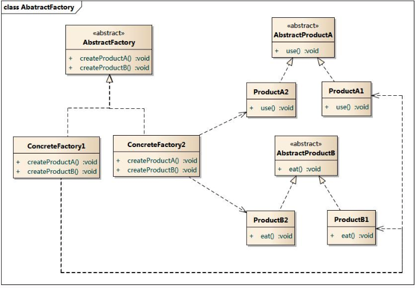
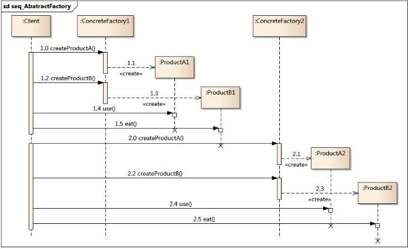

# 设计模式(三):抽象工厂模式

## 模式动机

​	在工厂方法模式中，每一个产品对应于每一个具体的工厂方法。但是一般的情况下，我们需要一个工厂可以提供多个产品对象，而不是单一的产品对象。

产品等级结构:产品等级结构业绩回升产品的继承结构，例如一个抽象类是数据库，数据库有MySQL、Oracle等。

产品族:在抽象工厂模式中，产品族着的是同一个工厂生产的，位于不同产品等级结构的一组产品，例如Oracle公司有Oracle数据库、Java语言等。

​	如果系统所提供的工厂所需生产的具体产品ing不是一个简单的对象，而是多个位于不同产品等级结构中属于不哦那个类型的具体产品时需要使用抽象工厂模式。

​	抽象工厂模式时所有的工厂模式中最为抽象和最具有一般性的一种形态。

​	抽象工厂模式于工厂方法模式最大的区别是，工厂方法模式一般是针对于一个产品等级结构，而抽象工厂模式针对于多个产品等级结构，一个工厂等级结构可以负责多个不同等级结构中的产品对象的创建。当一个工厂等级结构可以创建出分属不同产品等级结构的一个产品族中的所有对象时，抽象工厂模式比工厂方法模式更为简单、有效率。

## 模式定义

​	抽象工厂模式:提供一个创建一系列相关或相互依赖对象的接口，而无须指定它们具体的类。抽象工厂模式又称为Kit模式，属于对象创建型模式。

## 模式结构

抽象工厂模式包含如下角色：

- AbstractFactory：抽象工厂
- ConcreteFactory：具体工厂
- AbstractProduct：抽象产品
- Product：具体产品



## 时序图



## 代码示例

这里我们使用手机的示例类进行讲解，我们 这里有两个抽象类SOC和Screen，表示手机的SOC和屏幕。

```java
package cn.edu.hust.abstractFactory;

public abstract class SOC {
    public abstract String getName();
}

```

```java
package cn.edu.hust.abstractFactory;

public abstract class Screen {
    public abstract String getName();
}

```

针对于两种组件，有不同的厂商生产，SOC主要有高通和联发科，屏幕主要有三星和日本显示屏。

```java
package cn.edu.hust.abstractFactory;

public class GaoTongSoc extends SOC {
    public String getName() {
        return "GaoTong";
    }
}

```

```java
package cn.edu.hust.abstractFactory;

public class MTKSoc extends SOC {
    public String getName() {
        return "MTK";
    }
}

```

```java
package cn.edu.hust.abstractFactory;

public class SamsungScreen extends Screen {
    public String getName() {
        return "Samsung";
    }
}

```

```java
package cn.edu.hust.abstractFactory;

public class JDIScreen extends Screen
{
    public String getName() {
        return "JDI";
    }
}

```

这里我们使用两种手机品牌，小米和魅族，分别使用两种工厂来进行生产两种手机:

```java
package cn.edu.hust.abstractFactory;

public class MiFactory implements Factory {
    public SOC createSOC() {
        return new GaoTongSoc();
    }

    public Screen createScreen() {
        return new SamsungScreen();
    }
}

```

```java
package cn.edu.hust.abstractFactory;

public class MeizuFactory implements Factory{
    public SOC createSOC() {
        return new MTKSoc();
    }

    public Screen createScreen() {
        return new JDIScreen();
    }
}

```

小米手机使用高通SOC和三星的屏幕，魅族稍微差一点使用的联发科和JDI的屏幕。

## 抽象工厂模式优点

- 抽象工厂模式隔离了具体类的生成，使得客户并不需要知道什么被创建。由于这种隔离，更换一个具体工厂就变得相对容易。所有的具体工厂都实现了抽象工厂中定义的那些公共接口，因此只需改变具体工厂的实例，就可以在某种程度上改变整个软件系统的行为。另外，应用抽象工厂模式可以实现高内聚低耦合的设计目的，因此抽象工厂模式得到了广泛的应用。
- 当一个产品族中的多个对象被设计成一起工作时，它能够保证客户端始终只使用同一个产品族中的对象。这对一些需要根据当前环境来决定其行为的软件系统来说，是一种非常实用的设计模式。
- 增加新的具体工厂和产品族很方便，无须修改已有系统，符合“开闭原则”。

## 抽象工厂模式缺点

- 在添加新的产品对象时，难以扩展抽象工厂来生产新种类的产品，这是因为在抽象工厂角色中规定了所有可能被创建的产品集合，要支持新种类的产品就意味着要对该接口进行扩展，而这将涉及到对抽象工厂角色及其所有子类的修改，显然会带来较大的不便。
- 开闭原则的倾斜性（增加新的工厂和产品族容易，增加新的产品等级结构麻烦）。

## 适用场景

在以下情况下可以使用抽象工厂模式：

- 一个系统不应当依赖于产品类实例如何被创建、组合和表达的细节，这对于所有类型的工厂模式都是重要的。
- 系统中有多于一个的产品族，而每次只使用其中某一产品族。
- 属于同一个产品族的产品将在一起使用，这一约束必须在系统的设计中体现出来。
- 系统提供一个产品类的库，所有的产品以同样的接口出现，从而使客户端不依赖于具体实现。

## 工厂模式的退化

​	当抽象工厂模式中每一个具体工厂类只创建一个产品对象，也就是只存在一个产品等级结构时，抽象工厂模式退化成工厂方法模式；当工厂方法模式中抽象工厂与具体工厂合并，提供一个统一的工厂来创建产品对象，并将创建对象的工厂方法设计为静态方法时，工厂方法模式退化成简单工厂模式。
