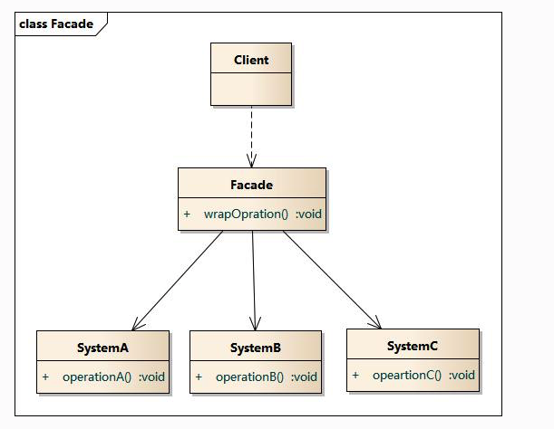
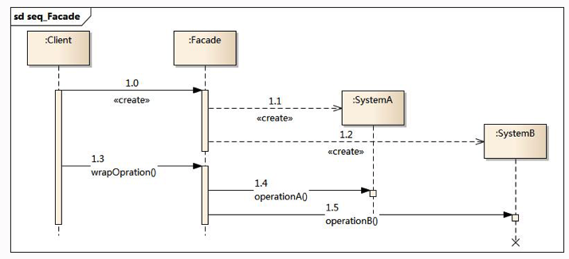

# 设计模式(九):外观模式

## 模式动机

​	设想一下在学校，你进宿舍的时候要用门禁卡，进入图书馆的时候要使用图书馆的卡，吃饭的时候要使用饭卡；一天你就要背着各种卡到处跑，尽管这些都不是很重，但是每次还有进行筛选之后才适用于不同的场景，会不会很累？考虑到这样一点，很多学校就将3卡合一，这样就非常方便了。在软件系统设计中，也存在这样的问题是否可以通过一个门面，进行统一的访问呢?今天我们来讲解外观模式，其目的就是解决多套子系统之间的统一访问问题。

## 模式定义

外观模式(Facade Pattern)：外部与一个子系统的通信必须通过一个统一的外观对象进行，为子系统中的一组接口提供一个一致的界面，外观模式定义了一个高层接口，这个接口使得这一子系统更加容易使用。外观模式又称为门面模式，它是一种对象结构型模式。 

## 模式结构

外观模式包含如下角色：

- Facade: 外观角色
- SubSystem:子系统角色



## 时序图



## 代码示例

这里我们还是手机为例子，市场上出现了很多无线充电的手机，例如小米8，IPhonex，这是我们今天的两个类:

```java
package cn.edu.hust.facade;

public class IPhone {
    //iphone使用自己的无线充充电
    public void change()
    {
        System.out.println("IPhone正在使用无线充充电");
    }
}

```

小米手机类

```java
package cn.edu.hust.facade;

public class MIPhone {
    //小米手机使用不同的无线充在充电
    public void change()
    {
        System.out.println("小米手机正在充电");
    }
}

```

想象一下，我们如果没有一种能同时兼容两种手机的无线充电器，也就是说每一个手机充电必须使用自己的无线充电器，那么针对于两种手机，必须要有两种无线充电器，这样，如果我们同时拥有多个手机，我们出门就要同时携带多个充电器。针对于人类，一直都是聪明的，我们是否能造出来一个充电器就可全部解决呢?这就是相当于我们今天的外观角色，代码如下:

```java
package cn.edu.hust.facade;
//这里我们相当于造了一个万能的无线充电器，可以给两种手机充电,当然小米已经有了
public class Changer {
    private IPhone iPhone;
    private MIPhone miPhone;

    public Changer(IPhone iPhone, MIPhone miPhone) {
        this.iPhone = iPhone;
        this.miPhone = miPhone;
    }

    //给小米手机充电
    public void changeMi()
    {
        miPhone.change();
    }

    //给iphone充电
    public void changeIphone()
    {
        iPhone.change();
    }
}

```

最后在使用的时候，我们只需要进行一个充电器即可:

```java
package cn.edu.hust.facade;


public class Client {
    public static void main(String[] args)
    {
        IPhone iPhoneX=new IPhone();
        MIPhone xiaoMi8=new MIPhone();
        Changer changer=new Changer(iPhoneX,xiaoMi8);
        //给iphonex充电
        changer.changeIphone();
        //给小米8充电
        changer.changeMi();
    }
}

```

## 模式分析

​	根据“单一职责原则”，在软件中将一个系统划分为若干个子系统有利于降低整个系统的复杂性，一个常见的设计目标是使子系统间的通信和相互依赖关系达到最小，而达到该目标的途径之一就是引入一个外观对象，它为子系统的访问提供了一个简单而单一的入口。 

​	外观模式也是“迪米特法则”的体现，通过引入一个新的外观类可以降低原有系统的复杂度，同时降低客户类与子系统类的耦合度。 

​	外观模式要求一个子系统的外部与其内部的通信通过一个统一的外观对象进行，外观类将客户端与子系统的内部复杂性分隔开，使得客户端只需要与外观对象打交道，而不需要与子系统内部的很多对象打交道。 

​	外观模式的目的在于降低系统的复杂程度。

​	外观模式从很大程度上提高了客户端使用的便捷性，使得客户端无须关心子系统的工作细节，通过外观角色即可调用相关功能。

## 模式优点

外观模式的优点

- 对客户屏蔽子系统组件，减少了客户处理的对象数目并使得子系统使用起来更加容易。通过引入外观模式，客户代码将变得很简单，与之关联的对象也很少。
- 实现了子系统与客户之间的松耦合关系，这使得子系统的组件变化不会影响到调用它的客户类，只需要调整外观类即可。
- 降低了大型软件系统中的编译依赖性，并简化了系统在不同平台之间的移植过程，因为编译一个子系统一般不需要编译所有其他的子系统。一个子系统的修改对其他子系统没有任何影响，而且子系统内部变化也不会影响到外观对象。
- 只是提供了一个访问子系统的统一入口，并不影响用户直接使用子系统类。

## 模式缺点

外观模式的缺点

- 不能很好地限制客户使用子系统类，如果对客户访问子系统类做太多的限制则减少了可变性和灵活性。
- 在不引入抽象外观类的情况下，增加新的子系统可能需要修改外观类或客户端的源代码，违背了“开闭原则”。

## 适用环境

在以下情况下可以使用外观模式：

- 当要为一个复杂子系统提供一个简单接口时可以使用外观模式。该接口可以满足大多数用户的需求，而且用户也可以越过外观类直接访问子系统。
- 客户程序与多个子系统之间存在很大的依赖性。引入外观类将子系统与客户以及其他子系统解耦，可以提高子系统的独立性和可移植性。
- 在层次化结构中，可以使用外观模式定义系统中每一层的入口，层与层之间不直接产生联系，而通过外观类建立联系，降低层之间的耦合度。
