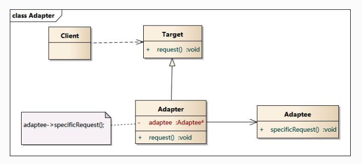
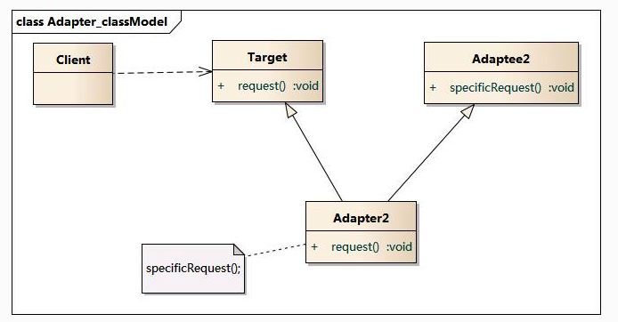
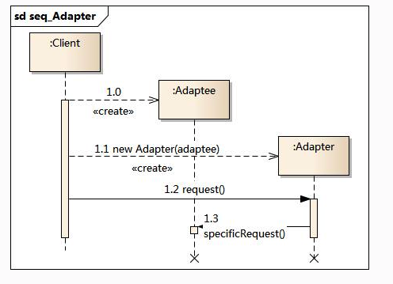

# 设计模式(六):适配器模式

## 模式动机

- 在软件开发中采用类似于电源适配器的设计和编码技巧被称为适配器模式。
- 通常情况下，客户端可以通过目标类的接口访问它所提供的服务。有时，现有的类可以满足客户类的功能需要，但是它所提供的接口不一定是客户类所期望的，这可能是因为现有类中方法名与目标类中定义的方法名不一致等原因所导致的。
- 在这种情况下，现有的接口需要转化为客户类期望的接口，这样保证了对现有类的重用。如果不进行这样的转化，客户类就不能利用现有类所提供的功能，适配器模式可以完成这样的转化。
- 在适配器模式中可以定义一个包装类，包装不兼容接口的对象，这个包装类指的就是适配器(Adapter)，它所包装的对象就是适配者(Adaptee)，即被适配的类。
- 适配器提供客户类需要的接口，适配器的实现就是把客户类的请求转化为对适配者的相应接口的调用。也就是说：当客户类调用适配器的方法时，在适配器类的内部将调用适配者类的方法，而这个过程对客户类是透明的，客户类并不直接访问适配者类。因此，适配器可以使由于接口不兼容而不能交互的类可以一起工作。这就是适配器模式的模式动机。

## 模式定义

​	适配器模式:将一个接口转化成为客户希望的另一个客户希望的另一个接口，适配器模式使接口不兼容的类可以工作在一起工作，其别名称为包装器(Wrapper)。适配器模式既可以作为类结构型模式，也可以作为对象结构型模式。

## 模式结构

适配器模式包含如下角色：

- Target：目标抽象类
- Adapter：适配器类
- Adaptee：适配者类
- Client：客户类

适配器模式有对象适配器和类适配器两种实现：

对象适配器：

 

类适配器:



## 时序图



## 代码示例

这里我使用常用的家庭用电的例子来进行举例:

我们已经有的电压是国家给的220V，是一个适配者对象

```java
package cn.edu.hust.adapter;

public class Adaptee {
    //原来有的业务
    public void use()
    {
        System.out.println("在使用220v的电");
    }
}

```

我们现在呢，手机需要充电，我们的目标是将这个转化为5V，于是有了目标类

```java
package cn.edu.hust.adapter;
//目标类
public interface Target {
    //这里想要将家庭用电的220V转化为5V
    void convertTo5V();
}

```

之后，我们希望使用一个手机的充电器，也就是在适配者模式中的适配器来进行转化

```java
package cn.edu.hust.adapter;

public class Adapter implements Target {
    private Adaptee adaptee;

    public Adapter(Adaptee adaptee) {
        this.adaptee = adaptee;
    }

    //转化后的业务逻辑
    public void convertTo5V() {
        adaptee.use();
        System.out.println("使用该适配器转化为5V");
    }
}

```

在将业务逻辑转化后，我们就可以使用了，现在就给我们的手机充电

```java
package cn.edu.hust.adapter;

public class Client {
    public static void main(String[] args)
    {
        Adaptee adaptee=new Adaptee();
        Adapter adapter=new Adapter(adaptee);
        adapter.convertTo5V();
    }
}

```

## 模式优点

- 将目标类和适配者类解耦，通过引入一个适配器类来重用现有的适配者类，而无须修改原有代码。
- 增加了类的透明性和复用性，将具体的实现封装在适配者类中，对于客户端类来说是透明的，而且提高了适配者的复用性。
- 灵活性和扩展性都非常好，通过使用配置文件，可以很方便地更换适配器，也可以在不修改原有代码的基础上增加新的适配器类，完全符合“开闭原则”。

类适配器模式还具有如下优点：

由于适配器类是适配者类的子类，因此可以在适配器类中置换一些适配者的方法，使得适配器的灵活性更强。

对象适配器模式还具有如下优点：

一个对象适配器可以把多个不同的适配者适配到同一个目标，也就是说，同一个适配器可以把适配者类和它的子类都适配到目标接口。

## 模式缺点

类适配器模式的缺点如下：

​	对于Java、C#等不支持多重继承的语言，一次最多只能适配一个适配者类，而且目标抽象类只能为抽象类，不能为具体类，其使用有一定的局限性，不能将一个适配者类和它的子类都适配到目标接口。

对象适配器模式的缺点如下：

​	与类适配器模式相比，要想置换适配者类的方法就不容易。如果一定要置换掉适配者类的一个或多个方法，就只好先做一个适配者类的子类，将适配者类的方法置换掉，然后再把适配者类的子类当做真正的适配者进行适配，实现过程较为复杂。

## 适用场景

在以下情况下可以使用适配器模式：

- 系统需要使用现有的类，而这些类的接口不符合系统的需要。
- 想要建立一个可以重复使用的类，用于与一些彼此之间没有太大关联的一些类，包括一些可能在将来引进的类一起工作。
