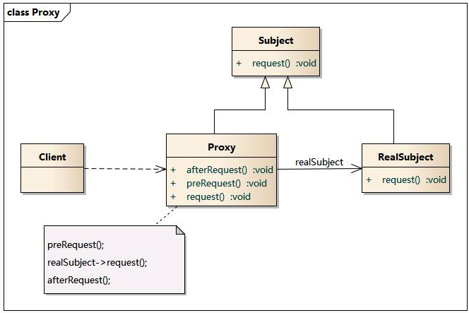
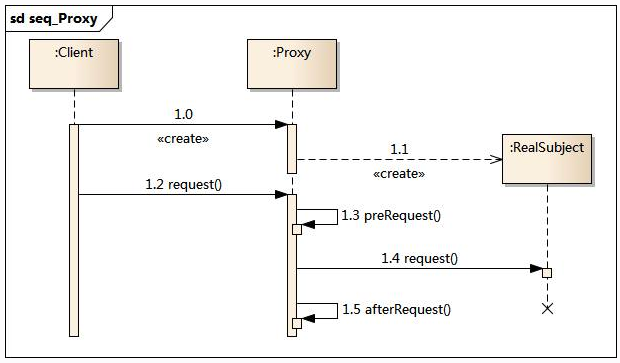

# 设计模式(十一):代理模式

## 模式动机

​	在某些情况下，一个客户不想或者不能直接引用一个对 象，此时可以通过一个称之为“代理”的第三者来实现 间接引用。代理对象可以在客户端和目标对象之间起到 中介的作用，并且可以通过代理对象去掉客户不能看到 的内容和服务或者添加客户需要的额外服务。

​	通过引入一个新的对象（如小图片和远程代理 对象）来实现对真实对象的操作或者将新的对 象作为真实对象的一个替身，这种实现机制即 为代理模式，通过引入代理对象来间接访问一 个对象，这就是代理模式的模式动机。

## 模式定义

​	代理模式(Proxy Pattern) ：给某一个对象提供一个代 理，并由代理对象控制对原对象的引用。代理模式的英 文叫做Proxy或Surrogate，它是一种对象结构型模式。

## 模式结构

代理模式包含如下角色：

- Subject: 抽象主题角色
- Proxy: 代理主题角色
- RealSubject: 真实主题角色



## 时序图



## 代码示例

这里我们使用一个玩游戏的例子来进行分析，对于玩游戏的人来说，玩累了，需要一些代理的人帮助自己杀Boss，这里我们有3个类:

游戏接口

```java
package cn.edu.hust.proxy.staticProxy;

public interface GameTask {
    void login(String name,String passwd);
    void killBoss();
    void upgade();
}

```

```Java
package cn.edu.hust.proxy.staticProxy;

public class GamePlayer implements GameTask {
    private String name;
    private String passwd;

    public GamePlayer() {
    }


    public GamePlayer(String name, String passwd) {
        this.name = name;
        this.passwd = passwd;
    }

    public void login(String name, String passwd) {
        System.out.println(name+" 登录成功..");
    }

    public void killBoss() {
        System.out.println(name+" 正在杀boss。。。");
    }

    public void upgade() {
        System.out.println(name +" 升级成功。。。。");
    }
}

```

代打人员:

```java
package cn.edu.hust.proxy.staticProxy;

public class GameProxy implements  GameTask{
    private GameTask gameTask;

    public GameProxy(GameTask gameTask) {
        this.gameTask = gameTask;
    }

    public void login(String name, String passwd) {
        this.gameTask.login(name,passwd);
    }

    public void killBoss() {
        this.gameTask.killBoss();
    }

    public void upgade() {
        this.gameTask.upgade();
    }
}

```

这里，我们使用的是一般的静态代理，需要实现自定义的代理类，那么有没有动态代理的类呢?

这个回答是肯定的，这里有两种动态代理的实现方式JDK动态代理和CGLIB动态代理。

## JDK动态代理

**JDK动态代理所用到的代理类在程序调用到代理类对象时才由JVM真正创建，JVM根据传进来的 业务实现类对象 以及 方法名 ，动态地创建了一个代理类的class文件并被字节码引擎执行，然后通过该代理类对象进行方法调用。**我们需要做的，只需指定代理类的预处理、调用后操作即可。

这里还是以上面的打游戏为例子:

1.业务逻辑接口:

```java
package cn.edu.hust.proxy.jdk;

public interface GameTask {
    void login(String name,String passwd);
    void killBoss();
    void upgade();
}

```

2.业务实现类，也就是需要代理的类

```java
package cn.edu.hust.proxy.jdk;

public class GamePalyer implements GameTask{
    private String name;

    public GamePalyer(String name) {
        this.name = name;
    }

    public void login(String name, String passwd) {
        System.out.println(this.name+" 登录成功...");
    }

    public void killBoss() {
        System.out.println(this.name+" 杀boss。。");
    }

    public void upgade() {
        System.out.println(this.name+" 升级。。");
    }
}

```

3.动态代理类

```java
package cn.edu.hust.proxy.jdk;

import java.lang.reflect.InvocationHandler;
import java.lang.reflect.Method;
import java.lang.reflect.Proxy;

public class GameProxy {
    public static  GameTask  invoke(ClassLoader classLoader, Class<?>[] interfaces, final Object object)
    {
        return (GameTask) Proxy.newProxyInstance(classLoader, interfaces, new InvocationHandler() {
            public Object invoke(Object proxy, Method method, Object[] args) throws Throwable {

                System.out.println("使用动态代理");
                return method.invoke(object,args);
            }
        });
    }
}

```

最后客户端调用:

```java
package cn.edu.hust.proxy.jdk;

public class ProxyTest {
    public static void main(String[] args)
    {
        GamePalyer player=new GamePalyer("张三");
        ClassLoader classLoader=player.getClass().getClassLoader();
        Class<?>[] interfaces=player.getClass().getInterfaces();
        GameTask gameTask= GameProxy.invoke(classLoader,interfaces,player);
        gameTask.login("张三","123");
        gameTask.killBoss();
        gameTask.upgade();
    }
}

```

​	JDK动态代理的代理对象在创建时，需要使用业务实现类所实现的接口作为参数（因为在后面代理方法时需要根据接口内的方法名进行调用）。如果业务实现类是没有实现接口而是直接定义业务方法的话，就无法使用JDK动态代理了。并且，如果业务实现类中新增了接口中没有的方法，这些方法是无法被代理的（因为无法被调用）。

## CGLIB动态代理

**cglib是针对类来实现代理的，原理是对指定的业务类生成一个子类，并覆盖其中业务方法实现代理。因为采用的是继承，所以不能对final修饰的类进行代理。** 

这里仍然以打游戏为例:

```Java
package cn.edu.hust.proxy.cglib;

public class GamePlayer {
    private String name;

    public GamePlayer() {
    }

    public GamePlayer(String name) {
        this.name = name;
    }

    public void login(String name,String passwd)
    {
        System.out.println(name+" 登录成功。。。");
    }

    public void killBoss()
    {
        System.out.println(this.name+" 正在杀boss。。。");
    }

    public void upgade()
    {
        System.out.println(this.name+" 升级。。。。");
    }
}

```

代理类:

```java
package cn.edu.hust.proxy.cglib;

import net.sf.cglib.proxy.Enhancer;
import net.sf.cglib.proxy.MethodInterceptor;
import net.sf.cglib.proxy.MethodProxy;

import java.lang.reflect.Method;

public class GamePlayerCGLiB implements MethodInterceptor
{
    private Object target;


    //相当于JDK动态代理中的绑定
    public Object getInstance(Object target) {
        this.target = target;  //给业务对象赋值
        Enhancer enhancer = new Enhancer(); //创建加强器，用来创建动态代理类
        enhancer.setSuperclass(this.target.getClass());  //为加强器指定要代理的业务类（即：为下面生成的代理类指定父类）
        //设置回调：对于代理类上所有方法的调用，都会调用CallBack，而Callback则需要实现intercept()方法进行拦
        enhancer.setCallback(this);
        // 创建动态代理类对象并返回
        return enhancer.create();
    }

    public Object intercept(Object o, Method method, Object[] objects, MethodProxy methodProxy) throws Throwable {
        System.out.println("进行操作之前。。。。");
        methodProxy.invoke(target,objects);
        System.out.println("进行操作之后。。。。");
        return null;
    }
}

```

客户端调用:

```java
package cn.edu.hust.proxy.cglib;

import java.util.LinkedList;
import java.util.List;

public class ProxyTest {
    public static void main(String[] args)
    {
        GamePlayer player=new GamePlayer("zhangSan");
        GamePlayerCGLiB  gamePlayerCGLiB=new GamePlayerCGLiB();
        GamePlayer player1=(GamePlayer) gamePlayerCGLiB.getInstance(player);
        player1.login("张三","123");
        player1.killBoss();
        player1.upgade();
        List<Integer> result=new LinkedList<Integer>();
        result.add(10);
        result.add(20);
        int[] t=new int[result.size()];
        for(int i=0;i<result.size();i++)
        {
            t[i]=result.get(i);
        }

    }
}

```

## 三种代理类的比较

​	静态代理是通过在代码中显式定义一个业务实现类一个代理，在代理类中对同名的业务方法进行包装，用户通过代理类调用被包装过的业务方法；

​    JDK动态代理是通过接口中的方法名，在动态生成的代理类中调用业务实现类的同名方法；

​    CGlib动态代理是通过继承业务类，生成的动态代理类是业务类的子类，通过重写业务方法进行代理；

## 模式优点

代理模式的优点

- 代理模式能够协调调用者和被调用者，在一定程度上降低了系 统的耦合度。
- 远程代理使得客户端可以访问在远程机器上的对象，远程机器 可能具有更好的计算性能与处理速度，可以快速响应并处理客户端请求。
- 虚拟代理通过使用一个小对象来代表一个大对象，可以减少系 统资源的消耗，对系统进行优化并提高运行速度。
- 保护代理可以控制对真实对象的使用权限。

## 模式缺点

代理模式的缺点

- 由于在客户端和真实主题之间增加了代理对象，因此 有些类型的代理模式可能会造成请求的处理速度变慢。
- 实现代理模式需要额外的工作，有些代理模式的实现 非常复杂。

## 适用环境

根据代理模式的使用目的，常见的代理模式有以下几种类型：

- 远程(Remote)代理：为一个位于不同的地址空间的对象提供一个本地 的代理对象，这个不同的地址空间可以是在同一台主机中，也可是在 另一台主机中，远程代理又叫做大使(Ambassador)。
- 虚拟(Virtual)代理：如果需要创建一个资源消耗较大的对象，先创建一个消耗相对较小的对象来表示，真实对象只在需要时才会被真正创建。
- Copy-on-Write代理：它是虚拟代理的一种，把复制（克隆）操作延迟 到只有在客户端真正需要时才执行。一般来说，对象的深克隆是一个 开销较大的操作，Copy-on-Write代理可以让这个操作延迟，只有对象被用到的时候才被克隆。
- 保护(Protect or Access)代理：控制对一个对象的访问，可以给不同的用户提供不同级别的使用权限。
- 缓冲(Cache)代理：为某一个目标操作的结果提供临时的存储空间，以便多个客户端可以共享这些结果。
- 防火墙(Firewall)代理：保护目标不让恶意用户接近。
- 同步化(Synchronization)代理：使几个用户能够同时使用一个对象而没有冲突。
- 智能引用(Smart Reference)代理：当一个对象被引用时，提供一些额外的操作，如将此对象被调用的次数记录下来等。

