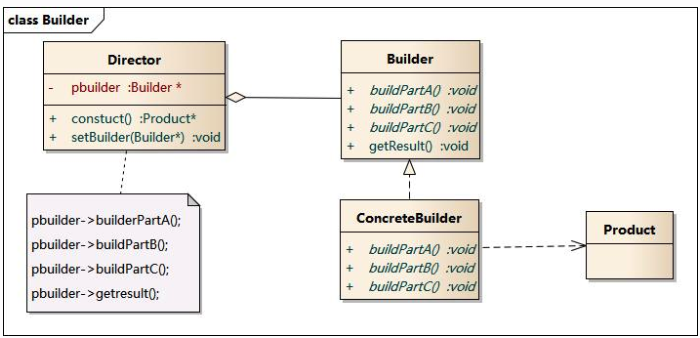
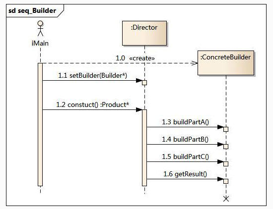

# 设计模式(四)建造者模式

## 模式动机

​	在现实生活中，有很多复杂的对象，拥有很多的组件，例如手机，有显示屏、CPU等；我们使用的时候是一起使用的，但是我们基本上不知道这些部件的实现细节，这时我们可以通过建造者模式对其进行设计和描述，建造者哦是将部件和其组装过程分开，一步一步创建一个复杂的对象，用户只需要指定复杂的类型就可以得到该对象，而无须知道其内部的具体构造细节。

​	在软件开发中，也存在大量类似汽车一样的复杂对象，它们拥有一系列成员属性，这些成员属性中有些是引用类型的成员对象。而且在这些复杂对象中，还可能存在一些限制条件，如某些属性没有赋值则复杂对象不能作为一个完整的产品使用；有些属性的赋值必须按照某个顺序，一个属性没有赋值之前，另一个属性可能无法赋值等。

​	由于组合部件的过程很复杂，因此，这些不见得组合过程往往被"外部化"到一个称为建造者的对象里，建造者返还给客户端的是一个已经建造完毕的完整产品对象，而用户无须关心该该对象所包含的属性以及它们的组装方式，这就是建造者模式的模式动机。

## 模式定义

​	建造者模式:将一个复杂对象的构建与它的表示分离，使得同样的构建可以创建不同的表示。

​	建造者模式是一步一步创建一个复杂的对象，它允许用户只通过指定复杂的类型和内容就可以构建它们，用户不需要知道内部的具体构建细节。建造者属于对象创建型模式。

## 模式结构

建造者模式包含如下角色：

- Builder：抽象建造者
- ConcreteBuilder：具体建造者
- Director：指挥者
- Product：产品角色



## 时序图



## 代码示例

这里我们以生产魅族手机为例，手机主要包含SOC和Screen，有这两个接口，不同的SOC和Screen

下面是具体的实现类:

```java
package cn.edu.hust.builder;

public abstract class SOC {
    public abstract String getName();
}

```

```java
package cn.edu.hust.builder;

public abstract class Screen {
    public abstract String getName();
}

```

Soc有MTK和高通，Screen有三星和日本显示:

```java
package cn.edu.hust.builder;

public class MTKSoc extends SOC {
    public String getName() {
        return "MTK";
    }
}

```

```java
package cn.edu.hust.builder;

public class JDIScreen extends Screen
{
    public String getName() {
        return "JDI";
    }
}

```

构建者的接口，以后只要实现这个接口可以构建不同的产品

```java
package cn.edu.hust.builder;

public interface Builder {
    Screen builderScreen();
    SOC builderSoc();
    MobilePhone getResult();
}
```

```java
package cn.edu.hust.builder;

public class ConcreteBuilder implements Builder{
    public Screen builderScreen() {
        return new JDIScreen();
    }

    public SOC builderSoc() {
        return new MTKSoc();
    }

    public MobilePhone getResult() {
        return new Meizu(builderSoc(),builderScreen());
    }
}

```

当然我们这里的实现类是魅族手机，这里实现MobilePhone接口

```java
package cn.edu.hust.builder;

public abstract class MobilePhone {
    public abstract String getBrand();
}

```

```java
package cn.edu.hust.builder;

public class Meizu extends MobilePhone
{
    private SOC soc;
    private Screen screen;

    public Meizu(SOC soc, Screen screen) {
        this.soc = soc;
        this.screen = screen;
    }

    public SOC getSoc() {
        return soc;
    }

    public void setSoc(SOC soc) {
        this.soc = soc;
    }

    public Screen getScreen() {
        return screen;
    }

    public void setScreen(Screen screen) {
        this.screen = screen;
    }

    public String getBrand() {
        return "Meizu";
    }
}

```

产品的具体构建者如下:

```java
package cn.edu.hust.builder;

public class Director {
    private Builder builder;

    //这里指定的建造者不同创建的产品不同
    public Director(Builder builder) {
        this.builder = builder;
    }


    public Builder getBuilder() {
        return builder;
    }

    public void setBuilder(Builder builder) {
        this.builder = builder;
    }

    public MobilePhone construct()
    {
        return builder.getResult();
    }
}

```

## 模式分析

抽象建造者类中定义了产品的创建方法和返回方法;

建造者模式的结构中还引入了一个指挥者类Director，该类的作用主要有两个：一方面它隔离了客户与生产过程；另一方面它负责控制产品的生成过程。指挥者针对抽象建造者编程，客户端只需要知道具体建造者的类型，即可通过指挥者类调用建造者的相关方法，返回一个完整的产品对象

在客户端代码中，无须关心产品对象的具体组装过程，只需确定具体建造者的类型即可，建造者模式将复杂对象的构建与对象的表现分离开来，这样使得同样的构建过程可以创建出不同的表现。

## 模式优点

- 在建造者模式中， **客户端不必知道产品内部组成的细节，将产品本身与产品的创建过程解耦，使得相同的创建过程可以创建不同的产品对象。**
- 每一个具体建造者都相对独立，而与其他的具体建造者无关，因此可以很方便地替换具体建造者或增加新的具体建造者， **用户使用不同的具体建造者即可得到不同的产品对象** 。
- **可以更加精细地控制产品的创建过程** 。将复杂产品的创建步骤分解在不同的方法中，使得创建过程更加清晰，也更方便使用程序来控制创建过程。
- **增加新的具体建造者无须修改原有类库的代码，指挥者类针对抽象建造者类编程，系统扩展方便，符合“开闭原则”。**

## 模式缺点

- 建造者模式所创建的产品一般具有较多的共同点，其组成部分相似，如果产品之间的差异性很大，则不适合使用建造者模式，因此其使用范围受到一定的限制。
- 如果产品的内部变化复杂，可能会导致需要定义很多具体建造者类来实现这种变化，导致系统变得很庞大。

## 适用环境

在以下情况下可以使用建造者模式：

- 需要生成的产品对象有复杂的内部结构，这些产品对象通常包含多个成员属性。
- 需要生成的产品对象的属性相互依赖，需要指定其生成顺序。
- 对象的创建过程独立于创建该对象的类。在建造者模式中引入了指挥者类，将创建过程封装在指挥者类中，而不在建造者类中。
- 隔离复杂对象的创建和使用，并使得相同的创建过程可以创建不同的产品。

